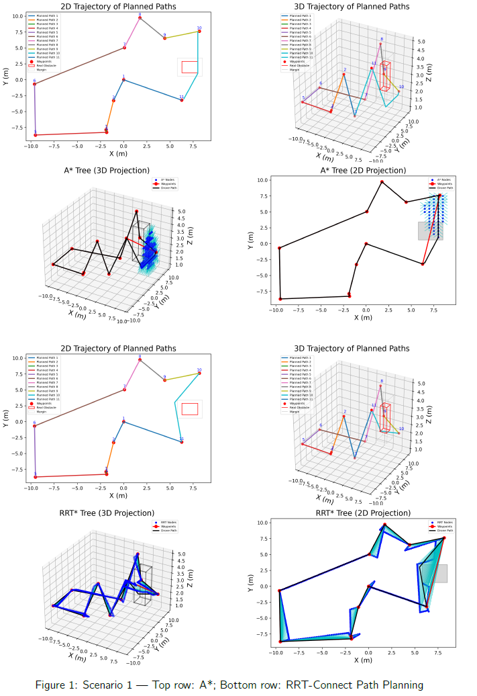

# Mission Planning Challenge

An expanded overview and guide for autonomous structural inspection path planning using Aerostack2, covering problem statement, methodology, repository structure, dependencies, usage, and results—including key screenshots from the accompanying report.

---

### Demo Video

<video
  src="challenge_mission_planning/docs/images/demovideo.mp4?raw=true"
  title="Mission Planning Challenge – Demo"
  width="800"
  preload="metadata"
  controls
  muted
  loop>
  Your browser can’t play this video.  
  <a href="challenge_mission_planning/docs/images/demovideo.mp4?raw=true">
    Download it here
  </a>.
</video>

---


## 1. Problem Statement and Objectives

Efficient structural inspections with autonomous drones are critical for tasks such as building surveys, bridge inspections, and other infrastructure evaluations. This project addresses the challenge of planning an optimal drone path that:

1. **Visits a series of inspection viewpoints**, each equipped with an ArUco marker to be captured.
2. **Avoids cuboid obstacles** in a cluttered 3D environment.
3. **Minimizes travel distance, time, and energy consumption** while ensuring mission safety and robustness.

To achieve this, we decompose the problem into two interlinked sub-problems:
- **Sequencing viewpoints** via a Traveling Salesman Problem (TSP) solver.
- **Collision-free trajectory planning** between viewpoints using A*, RRT-Connect, and RRT* (with optional B-Spline smoothing) algorithms. 

---

## 2. Repository Structure

This project is organized into several key directories and files. Below is an expanded view of the `challenge_mission_planning` folder, highlighting the most important components:

```
challenge_mission_planning/
├── docs/
│   └── images/                    # Pre-generated screenshots and figures used in README and reports
├── scenarios/                     # YAML definitions for start pose, waypoints, and obstacles
│   ├── scenario1.yaml
│   ├── scenario2.yaml
│   ├── scenario3.yaml
│   ├── scenario4.yaml
│   └── scenario5.yaml             # Complex/dense environment scenario
├── mission_scenario_astar_waypoint.py      # A* path planner between waypoints
├── mission_scenario_rrtc_waypoint.py       # RRT-Connect planner between waypoints
├── mission_scenario_rrtstar_nosmooth.py    # RRT* planner without path smoothing
├── mission_scenario_rrtstar_smooth.py      # RRT* planner with B-Spline smoothing enabled
├── mission_scenario_rrtstar_waypoint.py    # Combined waypoint execution wrapper for RRT* planners
├── launch_as2.bash                  # Launches Aerostack2 simulation with a given scenario
├── launch_ground_station.bash       # Launches ground station and RViz2 visualization
├── stop.bash                        # Gracefully stops all running ROS nodes and Gazebo
├── metrics.json                     # Logged performance metrics from last run
├── README.md                        # Project overview and usage instructions (this file)
└── report_ziya_ruso.pdf             # Full written report with in-depth evaluation
```

***Key files explained:***

- **`scenarios/`**: Each YAML file defines:
  - `initial_pose`: Starting location and orientation of the drone.
  - `viewpoints`: List of ArUco marker positions to visit.
  - `obstacles`: Cuboid definitions (size, position) for collision avoidance.

- **Planner scripts**:
  - `mission_scenario_astar_waypoint.py`: Implements grid-based A* between consecutive waypoints.
  - `mission_scenario_rrtc_waypoint.py`: Uses RRT-Connect for rapid sampling-based planning.
  - `mission_scenario_rrtstar_nosmooth.py`: Runs RRT* to find an optimal path (no smoothing).
  - `mission_scenario_rrtstar_smooth.py`: Applies B-Spline smoothing post-RRT* for continuous trajectories.
  - `mission_scenario_rrtstar_waypoint.py`: High-level wrapper that sequences waypoints and calls RRT* planners.

- **Launch & utility scripts**:
  - `launch_as2.bash`: Starts Aerostack2 with Gazebo Ignition world and scenario loaded.
  - `launch_ground_station.bash`: Opens the ground station interface and RViz2 for live visualization.
  - `stop.bash`: Ends all ROS nodes, Gazebo processes, and cleans up temporary files.

- **`metrics.json`**:
  - Automatically generated after each run.
  - Contains per-segment planning time, path length, smoothness score, and collision check counts.

---

## 3. Dependencies

- **ROS 2 Humble**
- **Gazebo Ignition & RViz2**
- **Aerostack2** and **Mocap4ROS2**
- **Python 3.6+** with:
  - `numpy`, `scipy` (TSP solver, interpolation)
  - `matplotlib`, `mpl_toolkits` (2D/3D plotting)
  - `opencv-python` (ArUco detection)
  - `pyyaml`, `rclpy`, `cv_bridge`, `nav_msgs`, `geometry_msgs`, `sensor_msgs`
  - **OMPL** (A*, RRT-Connect, RRT*) 

---

## 4. Installation

```bash
# Source ROS2
source /opt/ros/humble/setup.bash

# Create workspace
mkdir -p ~/mission_planning_ws/src
cd ~/mission_planning_ws/src

# Clone dependencies
git clone https://github.com/UCL-MSC-RAI-COMP0240/aerostack2.git
git clone https://github.com/MOCAP4ROS2-Project/mocap4r2_msgs.git
git clone https://github.com/UCL-MSC-RAI-COMP0240/as2_platform_crazyflie.git

# Clone this challenge
git clone https://github.com/UCL-MSC-RAI-COMP0240/challenge_mission_planning.git

# Build
cd ~/mission_planning_ws
colcon build
```  

---

## 5. Quickstart Usage

1. **Launch drone simulation**  
   ```bash
   ./launch_as2.bash -s scenarios/scenario1.yaml
   ```
2. **Launch ground station & RViz2**  
   ```bash
   ./launch_ground_station.bash -v
   ```
3. **Run mission script**  
   ```bash
   python3 mission_scenario.py -s scenarios/scenario1.yaml
   ```
4. **Shutdown**  
   ```bash
   ./stop.bash
   ```

Flags:
- `-s` scenario file  
- `-m` multi-drone  
- `-t` enable teleop  
- `-c` real hardware interface (Crazyflie)  

---

## 6. Methodology

### 6.1 Viewpoint Ordering (TSP)

- **Nearest-neighbour initial tour** followed by **3-opt local search** to refine ordering.  
- **Euclidean distance** cost metric ensures minimized travel distance (proxy for time/energy).  
- Scales well for scenarios 1–4; custom scenario 5 designed to test limits.
### 6.2 Collision-Free Trajectory Planning

- **A***: Grid-based heuristic search—fast in sparse spaces but costly in dense 3D grids.  
- **RRT-Connect**: Rapid random sampling—good “first solution” in open areas.  
- **RRT***: Asymptotically optimal—path quality improves with time, ideal for cluttered spaces.  
- **Recursive subdivision** of colliding segments ensures robustness in narrow passages.

### 6.3 Trajectory Generation & Smoothing (Scenario 5)

- **B-Spline smoothing** applied to raw RRT* paths for continuous trajectories with gentle curvature.  
- Smooth path converted to **ROS Path** and executed as a single command via Aerostack2’s TrajectoryGenerationModule.  
- Traded ~5 m extra distance for a 5× increase in path smoothness and zero collisions.

---

## 7. Results & Discussion

### Scenario 1: A* vs RRT-Connect

  
*Figure 1: Top row A*, bottom row RRT-Connect path planning.* 

Both planners achieve similar path lengths in simple environments, but RRT-Connect often yields slightly lower average planning time and energy consumption.

### Scenario 5: Dense Environment

  
*Figure 5: RViz trajectory (left) vs. Gazebo environment (right).* 

RRT* with B-Spline smoothing handles narrow passages reliably, where straight go-to commands fail without collisions.

### Path Comparison

  
*Figure 6: (a) B-Spline smoothed path vs (b) non-smoothed.*

Although smoothed paths are ~5 m longer and take ~18 s more, they reduce abrupt turns (smoothness 7.45 vs 2.11) and eliminate collision risk.

---

## 8. Metrics & Verification

- **Metrics logged** in `metrics.json`: total path length, segment planning times, smoothness, energy estimates, fallback counts.  
- **Marker verification** via ArUco detection ensures each waypoint’s correctness; fallback logic tolerates missed detections. 

---

## 9. Extending & Custom Scenarios

- **Add YAML** files in `scenarios/` to define new environments.  
- **Algorithm parameters** (e.g., safety margin, planning time) configurable at script top.  
- **Visualization helpers** available in Python scripts for 2D/3D plotting of trees, paths, and metrics.

---

## 10. Acknowledgements

Based on the UCL Aerial Robotics COMP0240 coursework, developed by Ziya Ruso (March 14, 2025). For the full report and detailed analysis, see `report_ziya_ruso.pdf`.
